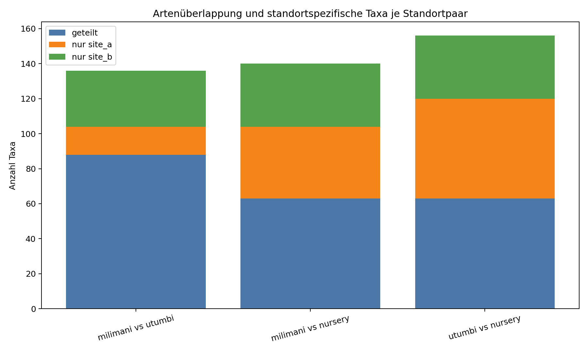
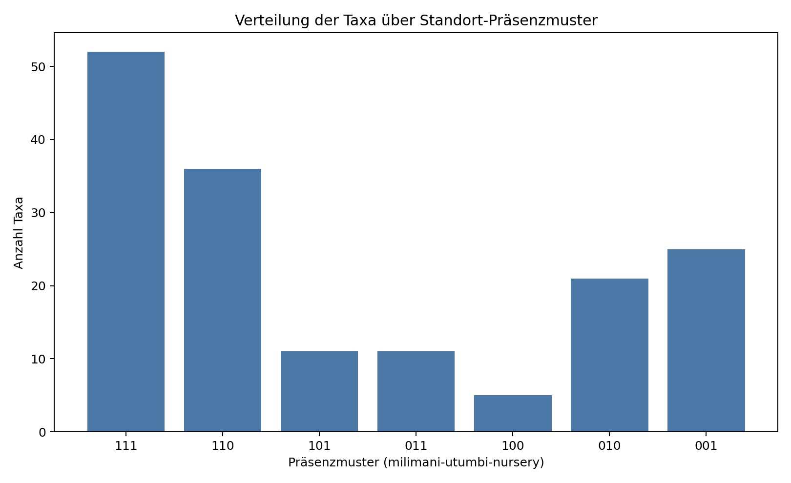
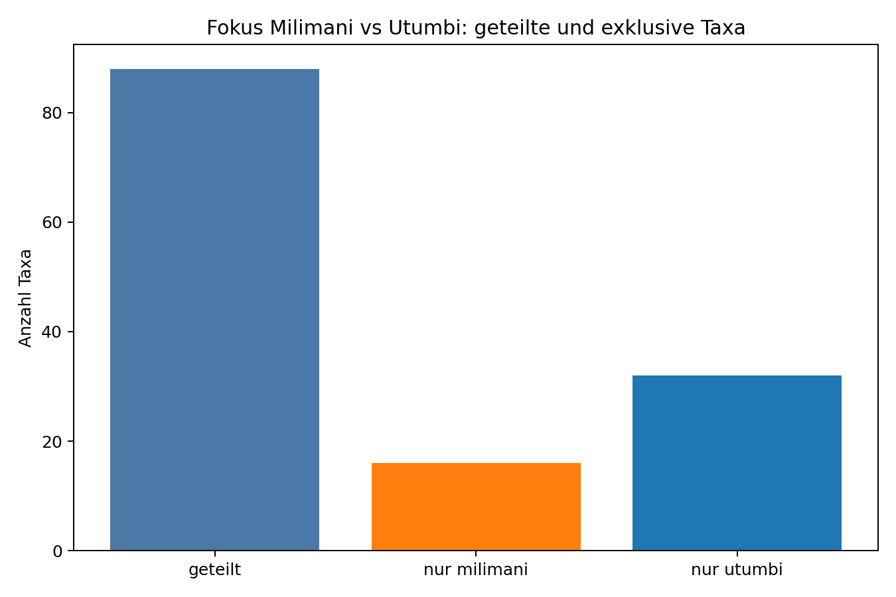

# Artenvergleich der Standorte (cut_47min)

## Kurzfazit
Fokus Milimani/Utumbi: hohe Überlappung bei gleichzeitig klar vorhandenen standortspezifischen Taxa.

## Datengrundlage
- Anzahl Videos: 46
- Standorte: Milimani, Utumbi, Nursery
- Quelle: normalized_reports/cut_47min
- Taxonbildung: species > genus > family/label; feeding/interested ausgeschlossen

## Fokus: Milimani vs Utumbi
- Milimani vs Utumbi teilen 88 Taxa (Jaccard=0.647). Exklusiv: Milimani=16, Utumbi=32.
- Hintergrund: Beide Standorte wurden mit denselben Köderkategorien beprobt.

## Standortpaare im Vergleich
| site_a   | site_b   |   n_taxa_a |   n_taxa_b |   intersection_taxa |   union_taxa |   jaccard_similarity |   jaccard_distance |   unique_a |   unique_b |
|:---------|:---------|-----------:|-----------:|--------------------:|-------------:|---------------------:|-------------------:|-----------:|-----------:|
| milimani | utumbi   |        104 |        120 |                  88 |          136 |             0.647059 |           0.352941 |         16 |         32 |
| milimani | nursery  |        104 |         99 |                  63 |          140 |             0.45     |           0.55     |         41 |         36 |
| utumbi   | nursery  |        120 |         99 |                  63 |          156 |             0.403846 |           0.596154 |         57 |         36 |

## Standortspezifische Taxa
| standort   |   n_site_specific_taxa |
|:-----------|-----------------------:|
| nursery    |                     25 |
| utumbi     |                     21 |
| milimani   |                      5 |

### Vollständige Listen standortspezifischer Taxa

#### milimani (5 Taxa)
- family_label::butterflyfishes (chaetodontidae)
- family_label::filefishes (monacanthidae)
- family_label::turtle (cheloniidae)
- species::lyretail hogfish (bodianus anthioides)
- species::masked banner (heniochus monoceros)

#### utumbi (21 Taxa)
- family_label::morays (muraenidae)
- family_label::naso feeding
- family_label::scorpion-&lionfishes (scorpaenidae)
- genus::genus ctenochaetus
- species::blacktip (epinephelus fasciatus)
- species::cigar (cheilio inermis)
- species::claudia (halichoeres claudia)
- species::clown (coris aygula)
- species::five-saddle (scarus saber)
- species::golden (ctenochaetus truncates)
- species::indian half-and-half (pycnochromis dimidiatusf)
- species::palenose (scarus psittacus)
- species::piano fangblenny (plagiotremus tapeinosoma)
- species::powder blue (acanthurus leucosternon)
- species::queenfish (scomberoides lysan)
- species::spot-tail (coris caudimacula)
- species::sulfur (pomacentrus sulfureus)
- species::threespot (apolemichthys trimaculatus)
- species::whiteline (stethojulis albovittata)
- species::yellowbreast (anampses twistii)
- species::yellowtail (anampses meleagrides)

#### nursery (25 Taxa)
- family_label::batfishes (ephippidae)
- family_label::parrotfishes feeding
- family_label::siganus feeding
- family_label::snappers (lutjanidae)
- family_label::trumpetfishes (aulostomidae)
- genus::canthigaster
- genus::chromis
- genus::dascyllus
- genus::zebrasoma
- species::blackspot (lutjanus fulviflamma)
- species::blackspot feeding (lutjanus fulviflamma)
- species::blackwhite (macolor niger)
- species::blackwhite feeding (macolor niger)
- species::blue barred (scarus ghobban)
- species::coral (cephalopholis miniata)
- species::goldsaddle (parupeneus cyclostomus)
- species::humpback (lutjanus gibbus)
- species::mahsena (lethrinus mahsena)
- species::map (arothron mappa)
- species::peacock damsel (pomacentrus pavo)
- species::queen (coris formosa)
- species::threespot dascyllus (dascyllus trimaculatus)
- species::thumbprint (lethrinus harak)
- species::yellow-margin (gymnothorax flavimarginatus)
- species::yellowmargin (pseudobalistes flavimarginatus)

## Taxa in allen drei Standorten
- Anzahl: 52

## Präsenzmuster
|   presence_pattern |   n_taxa |
|-------------------:|---------:|
|                111 |       52 |
|                110 |       36 |
|                001 |       25 |
|                010 |       21 |
|                011 |       11 |
|                101 |       11 |
|                100 |        5 |

### Bedeutung der Muster-Codes
|   presence_pattern | meaning               |
|-------------------:|:----------------------|
|                111 | in allen 3 Standorten |
|                110 | milimani + utumbi     |
|                101 | milimani + nursery    |
|                011 | utumbi + nursery      |
|                100 | nur milimani          |
|                010 | nur utumbi            |
|                001 | nur nursery           |

## Grafiken
- figures/pairwise_shared_unique_taxa.png
- figures/taxa_presence_patterns.png
- figures/focus_milimani_utumbi_shared_unique.png
- figures/site_specific_taxa_counts.png

### Abbildungen

## Exportierte Detaildateien
- pairwise_site_overlap.csv
- taxa_presence_by_site.csv
- taxa_presence_patterns_summary.csv
- site_specific_taxa_long.csv
- focus_milimani_utumbi_taxa_lists.csv
- shared_all_three_sites_taxa.csv
