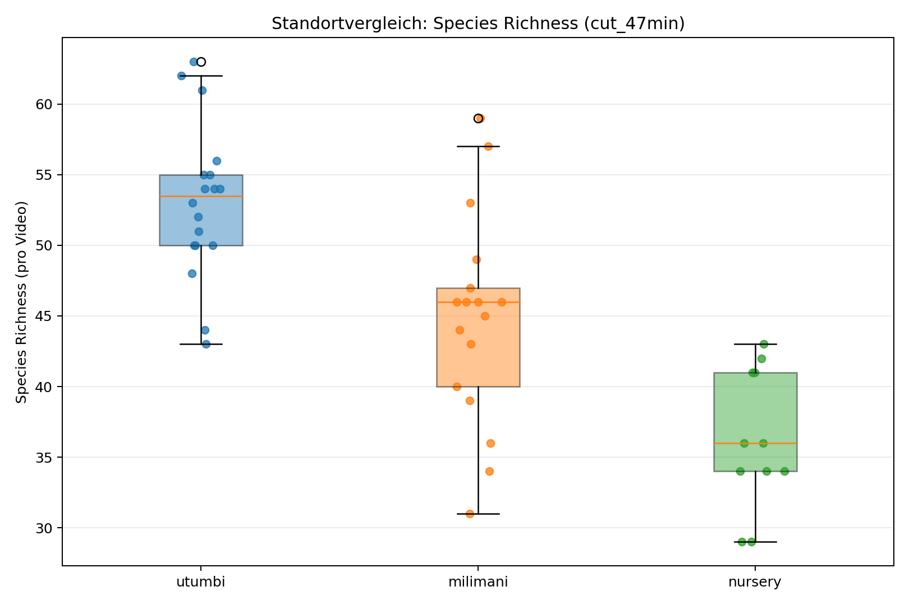
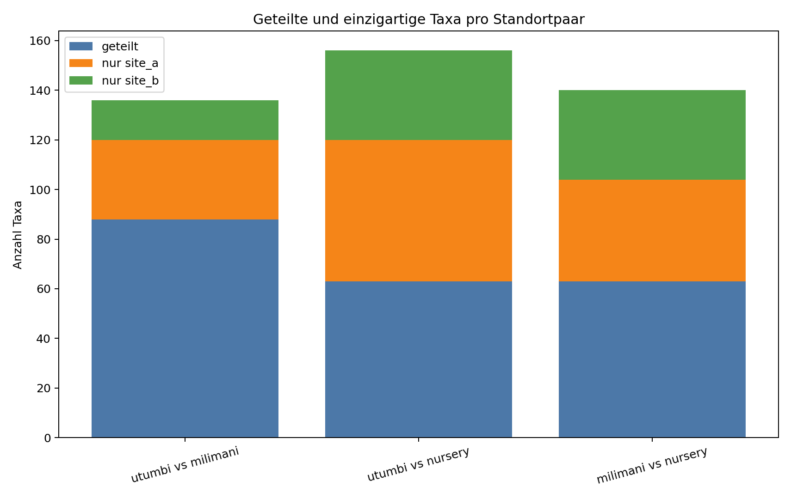
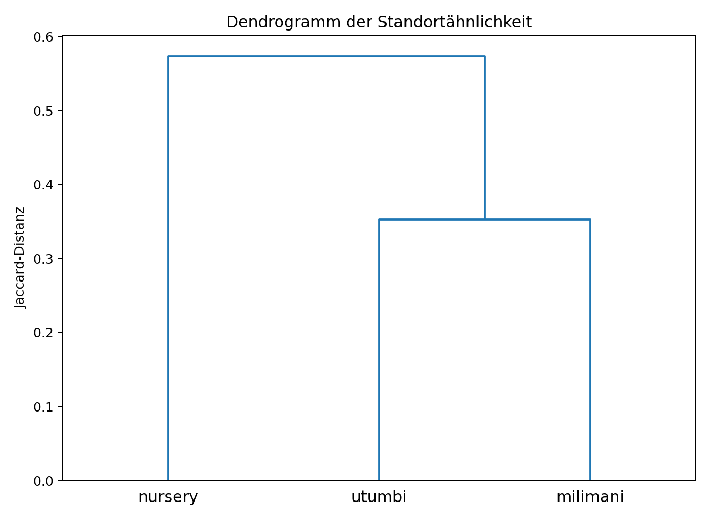

# Standortvergleich (cut_47min)

## Kurzfazit
Standorte **nicht** als direkte Replikate behandeln (signifikante Standorteffekte vorhanden).

## Datengrundlage
- Anzahl Videos gesamt: 46
- Standorte: Utumbi, Milimani, Nursery
- Basis: normalized_reports/cut_47min
- Metrik pro Video: Species Richness (unique Taxa; feeding/interested ausgeschlossen)

## Schwerpunktvergleiche
- utumbi vs milimani: p=0.001344, Holm-p=0.002688, signifikant(Holm)=True, Delta=0.637
- utumbi vs nursery: p=1.015e-05, Holm-p=3.044e-05, signifikant(Holm)=True, Delta=0.995
- milimani vs nursery: p=0.002934, Holm-p=0.002934, signifikant(Holm)=True, Delta=0.679

## Köder-kontrollierter Test (Utumbi vs Milimani)
Zur Kontrolle eines potenziellen Köder-Bias wurde ein stratifizierter Permutationstest durchgeführt, bei dem die Standortlabels ausschließlich innerhalb derselben Köderkategorie permutiert wurden (20.000 Permutationen). In die Analyse gingen nur gemeinsame Köderkategorien beider Standorte ein (control, fischmix, mackerel, sargassum, ulva_gutweed, ulva_salad), sodass die Köderstruktur zwischen den verglichenen Gruppen erhalten blieb.

Der Test ergab für Utumbi gegenüber Milimani eine mittlere Differenz der Species Richness von 8.291 (Utumbi minus Milimani) bei einem p-Wert von 0.00085. Der Unterschied bleibt damit auch unter Köderkontrolle statistisch signifikant. Dies spricht für einen eigenständigen Standorteffekt, der nicht allein durch Unterschiede in der Köderzusammensetzung erklärbar ist.

## Statistik-Tabellen
### Deskriptive Statistik je Standort
| standort   |   n |    mean |   median |     std |   min |   max |
|:-----------|----:|--------:|---------:|--------:|------:|------:|
| milimani   |  17 | 44.7647 |     46   | 7.46265 |    31 |    59 |
| nursery    |  11 | 36.2727 |     36   | 4.94148 |    29 |    43 |
| utumbi     |  18 | 53.0556 |     53.5 | 5.43921 |    43 |    63 |

### Globaltest über alle 3 Standorte
| test                                         | groups                    |   h_stat |     p_value | significant_0_05   | sig_label   |
|:---------------------------------------------|:--------------------------|---------:|------------:|:-------------------|:------------|
| Kruskal-Wallis (species_richness ~ standort) | utumbi, milimani, nursery |  25.5301 | 2.85899e-06 | True               | ***         |

### Paarweise Standorttests
| site_a   | site_b   |   n_a |   n_b |   median_a |   median_b |   mean_a |   mean_b |   mean_diff_a_minus_b |   u_stat |     p_value |   cliffs_delta |   p_value_holm | significant_0_05   | significant_0_05_holm   | sig_label_raw   | sig_label_holm   |
|:---------|:---------|------:|------:|-----------:|-----------:|---------:|---------:|----------------------:|---------:|------------:|---------------:|---------------:|:-------------------|:------------------------|:----------------|:-----------------|
| utumbi   | nursery  |    18 |    11 |       53.5 |         36 |  53.0556 |  36.2727 |              16.7828  |    197.5 | 1.01467e-05 |       0.994949 |    3.04401e-05 | True               | True                    | ***             | ***              |
| utumbi   | milimani |    18 |    17 |       53.5 |         46 |  53.0556 |  44.7647 |               8.29085 |    250.5 | 0.00134397  |       0.637255 |    0.00268795  | True               | True                    | **              | **               |
| milimani | nursery  |    17 |    11 |       46   |         36 |  44.7647 |  36.2727 |               8.49198 |    157   | 0.00293415  |       0.679144 |    0.00293415  | True               | True                    | **              | **               |

### Artenpool-Überlappung
| site_a   | site_b   |   n_taxa_a |   n_taxa_b |   intersection_taxa |   union_taxa |   jaccard_similarity |   jaccard_distance |   unique_a |   unique_b |
|:---------|:---------|-----------:|-----------:|--------------------:|-------------:|---------------------:|-------------------:|-----------:|-----------:|
| utumbi   | milimani |        120 |        104 |                  88 |          136 |             0.647059 |           0.352941 |         32 |         16 |
| utumbi   | nursery  |        120 |         99 |                  63 |          156 |             0.403846 |           0.596154 |         57 |         36 |
| milimani | nursery  |        104 |         99 |                  63 |          140 |             0.45     |           0.55     |         41 |         36 |

## Grafiken
- figures/species_richness_by_site_boxplot.png
- figures/site_pool_jaccard_heatmap.png
- figures/site_overlap_pcoa_jaccard.png
- figures/shared_unique_taxa_pairwise.png
- figures/site_distance_dendrogram.png

### Abbildungen

## Interpretation zur Replikat-Frage
- Wenn global oder paarweise (Holm-korrigiert) signifikant: Standorteffekt spricht gegen Replikatannahme.
- Wenn nicht signifikant, aber Überlappung gering (niedriger Jaccard) oder klare Cluster in PCoA: ebenfalls Vorsicht bei Replikatannahme.
