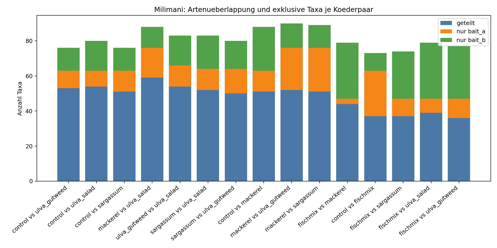
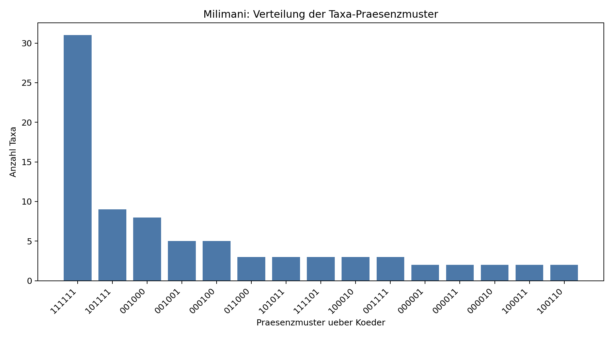
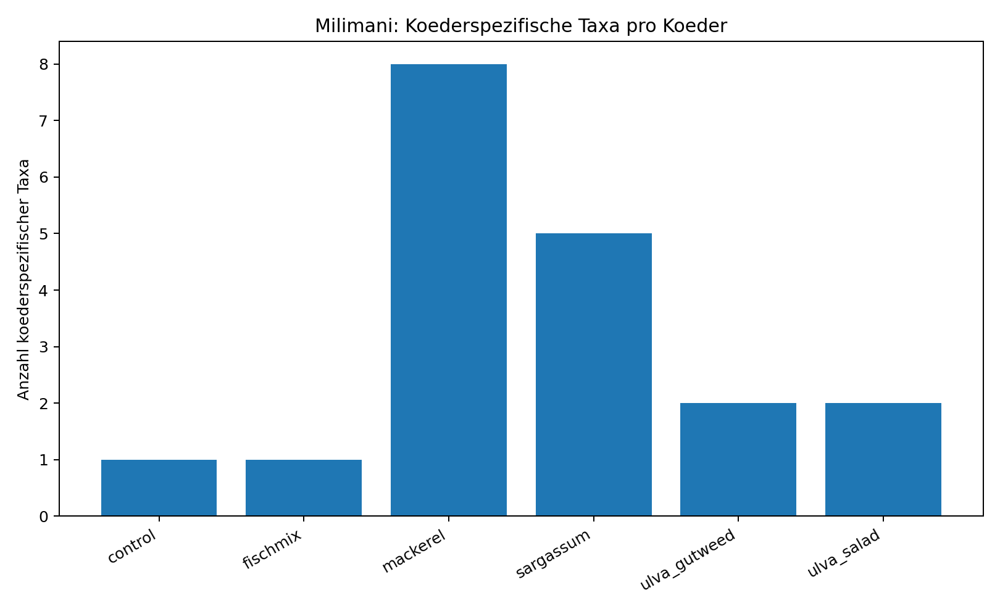

# Artenvergleich Koeder - Milimani (cut_47min)

## Datengrundlage
- Standort: milimani
- Anzahl Videos: 17
- Koeder: control, fischmix, mackerel, sargassum, ulva_gutweed, ulva_salad
- Taxonbildung: species > genus > family/label; feeding/interested ausgeschlossen

## Kurzfazit
- Hoechste Ueberlappung: control vs ulva_gutweed (Jaccard=0.697, geteilt=53).
- Taxa, die in allen Koedern dieses Standorts vorkommen: 31

## Koederpaare im Vergleich
| bait_a       | bait_b       |   n_taxa_a |   n_taxa_b |   intersection_taxa |   union_taxa |   jaccard_similarity |   jaccard_distance |   unique_a |   unique_b |
|:-------------|:-------------|-----------:|-----------:|--------------------:|-------------:|---------------------:|-------------------:|-----------:|-----------:|
| control      | ulva_gutweed |         63 |         66 |                  53 |           76 |             0.697368 |           0.302632 |         10 |         13 |
| control      | ulva_salad   |         63 |         71 |                  54 |           80 |             0.675    |           0.325    |          9 |         17 |
| control      | sargassum    |         63 |         64 |                  51 |           76 |             0.671053 |           0.328947 |         12 |         13 |
| mackerel     | ulva_salad   |         76 |         71 |                  59 |           88 |             0.670455 |           0.329545 |         17 |         12 |
| ulva_gutweed | ulva_salad   |         66 |         71 |                  54 |           83 |             0.650602 |           0.349398 |         12 |         17 |
| sargassum    | ulva_salad   |         64 |         71 |                  52 |           83 |             0.626506 |           0.373494 |         12 |         19 |
| sargassum    | ulva_gutweed |         64 |         66 |                  50 |           80 |             0.625    |           0.375    |         14 |         16 |
| control      | mackerel     |         63 |         76 |                  51 |           88 |             0.579545 |           0.420455 |         12 |         25 |
| mackerel     | ulva_gutweed |         76 |         66 |                  52 |           90 |             0.577778 |           0.422222 |         24 |         14 |
| mackerel     | sargassum    |         76 |         64 |                  51 |           89 |             0.573034 |           0.426966 |         25 |         13 |
| fischmix     | mackerel     |         47 |         76 |                  44 |           79 |             0.556962 |           0.443038 |          3 |         32 |
| control      | fischmix     |         63 |         47 |                  37 |           73 |             0.506849 |           0.493151 |         26 |         10 |
| fischmix     | sargassum    |         47 |         64 |                  37 |           74 |             0.5      |           0.5      |         10 |         27 |
| fischmix     | ulva_salad   |         47 |         71 |                  39 |           79 |             0.493671 |           0.506329 |          8 |         32 |
| fischmix     | ulva_gutweed |         47 |         66 |                  36 |           77 |             0.467532 |           0.532468 |         11 |         30 |

## Koederspezifische Taxa (Anzahl)
| koeder       |   n_bait_specific_taxa |   n_videos |
|:-------------|-----------------------:|-----------:|
| mackerel     |                      8 |          3 |
| sargassum    |                      5 |          3 |
| ulva_gutweed |                      2 |          3 |
| ulva_salad   |                      2 |          4 |
| fischmix     |                      1 |          1 |
| control      |                      1 |          3 |

## Vollstaendige Listen koederspezifischer Taxa

### control (1 Taxa)
- species::scrawled (aluterus scriptus)

### fischmix (1 Taxa)
- species::blue-green (chromis viridis)

### mackerel (8 Taxa)
- family_label::cornetfishes (fistulariidae)
- family_label::filefishes (monacanthidae)
- species::arabian monocle (scolopsis ghanam)
- species::monk (acanthurus gahhm)
- species::potato (epinephelus tukula)
- species::sailfin tang (zebrasoma desjardinii)
- species::undulated (gymnothorax undulatus)
- species::weber's puller (chromis weberi)

### sargassum (5 Taxa)
- family_label::goatfishes (mullidae)
- family_label::turtle (cheloniidae)
- species::elegant unicorn (naso elegans)
- species::spotted (cetoscarus ocellatus)
- species::stareye (calotomus carolinus)

### ulva_gutweed (2 Taxa)
- genus::genus squirrel
- species::bicolor (labroides bicolor)

### ulva_salad (2 Taxa)
- family_label::surgeonfishes (acanthuridae)
- species::rockmover (novaculichthys taeniourus)

## Praesenzmuster ueber Koeder
|   presence_pattern |   n_taxa |
|-------------------:|---------:|
|             111111 |       31 |
|             101111 |        9 |
|             001000 |        8 |
|             001001 |        5 |
|             000100 |        5 |
|             011000 |        3 |
|             101011 |        3 |
|             111101 |        3 |
|             100010 |        3 |
|             001111 |        3 |
|             000001 |        2 |
|             000011 |        2 |
|             000010 |        2 |
|             100011 |        2 |
|             100110 |        2 |

## Grafiken
- ../figures/milimani/pairwise_shared_unique_taxa.png
- ../figures/milimani/taxa_presence_patterns.png
- ../figures/milimani/bait_specific_taxa_counts.png

### Abbildungen

