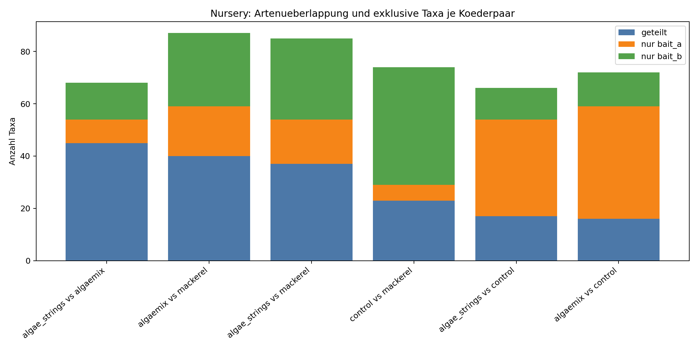
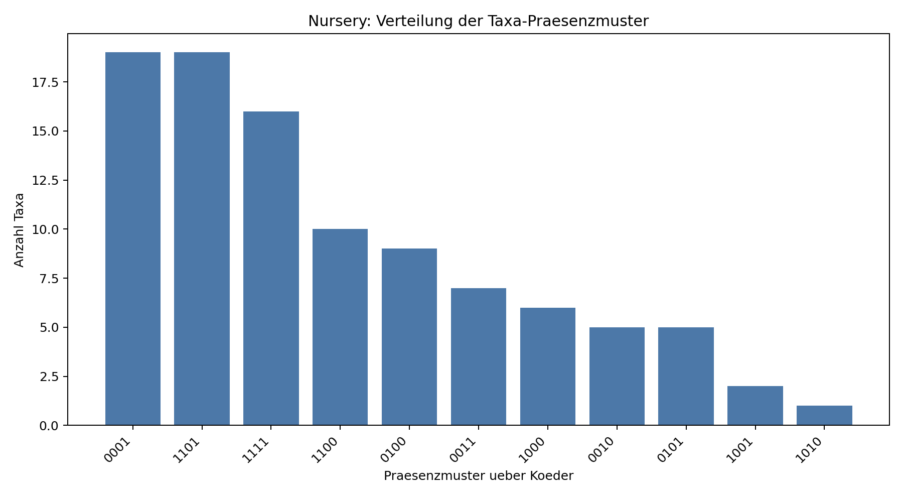
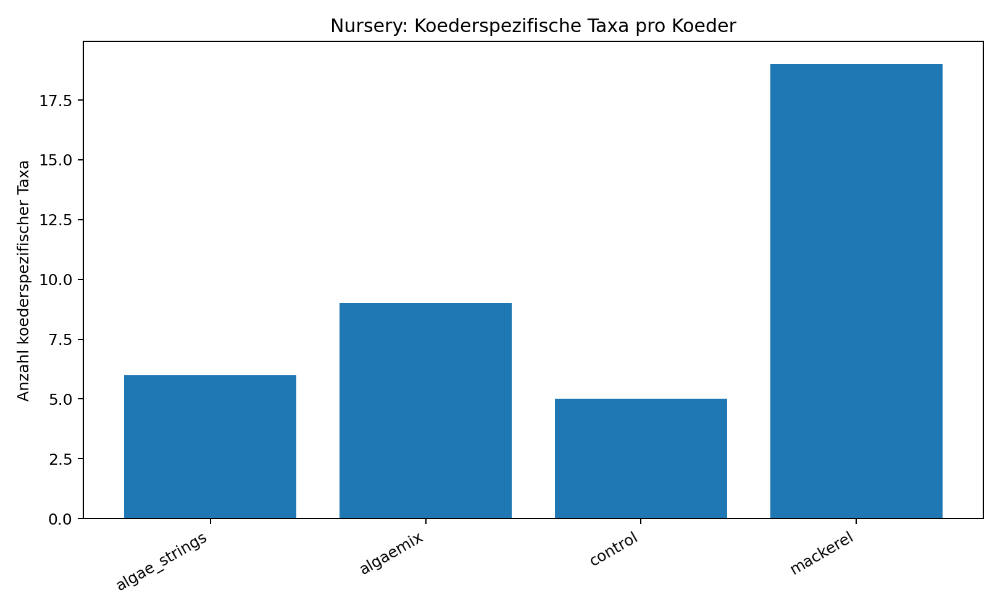

# Artenvergleich Koeder - Nursery (cut_47min)

## Datengrundlage
- Standort: nursery
- Anzahl Videos: 11
- Koeder: algae_strings, algaemix, control, mackerel
- Taxonbildung: species > genus > family/label; feeding/interested ausgeschlossen

## Kurzfazit
- Hoechste Ueberlappung: algae_strings vs algaemix (Jaccard=0.662, geteilt=45).
- Taxa, die in allen Koedern dieses Standorts vorkommen: 16

## Koederpaare im Vergleich
| bait_a        | bait_b   |   n_taxa_a |   n_taxa_b |   intersection_taxa |   union_taxa |   jaccard_similarity |   jaccard_distance |   unique_a |   unique_b |
|:--------------|:---------|-----------:|-----------:|--------------------:|-------------:|---------------------:|-------------------:|-----------:|-----------:|
| algae_strings | algaemix |         54 |         59 |                  45 |           68 |             0.661765 |           0.338235 |          9 |         14 |
| algaemix      | mackerel |         59 |         68 |                  40 |           87 |             0.45977  |           0.54023  |         19 |         28 |
| algae_strings | mackerel |         54 |         68 |                  37 |           85 |             0.435294 |           0.564706 |         17 |         31 |
| control       | mackerel |         29 |         68 |                  23 |           74 |             0.310811 |           0.689189 |          6 |         45 |
| algae_strings | control  |         54 |         29 |                  17 |           66 |             0.257576 |           0.742424 |         37 |         12 |
| algaemix      | control  |         59 |         29 |                  16 |           72 |             0.222222 |           0.777778 |         43 |         13 |

## Signifikanztests (Taxa-Zusammensetzung)
Methodik: PERMANOVA mit Jaccard-Distanzen auf Videoebene (Presence/Absence), Permutationstest.
Permutationenzahl: 5000, alpha=0.05.

### Globaler Test je Standort
| test                                                    | groups                                     |   n_videos |   n_groups |   pseudo_f |    p_value |   n_perm | significant_0_05   | sig_label   | note   |
|:--------------------------------------------------------|:-------------------------------------------|-----------:|-----------:|-----------:|-----------:|---------:|:-------------------|:------------|:-------|
| PERMANOVA (Jaccard distance, taxa composition ~ koeder) | algae_strings, algaemix, control, mackerel |         11 |          4 |    2.08998 | 0.00159968 |     5000 | True               | **          |        |

### Paarweise Koeder-Tests
| group_a       | group_b   |   n_a |   n_b |   n_videos |   pseudo_f |   p_value |   n_perm | note   |   p_value_holm | significant_0_05   | significant_0_05_holm   | sig_label_raw   | sig_label_holm   |
|:--------------|:----------|------:|------:|-----------:|-----------:|----------:|---------:|:-------|---------------:|:-------------------|:------------------------|:----------------|:-----------------|
| algae_strings | mackerel  |     3 |     4 |          7 |    2.73707 | 0.034993  |     5000 |        |       0.209958 | True               | False                   | *               | ns               |
| algaemix      | mackerel  |     3 |     4 |          7 |    2.09287 | 0.0619876 |     5000 |        |       0.309938 | False              | False                   | ns              | ns               |
| control       | mackerel  |     1 |     4 |          5 |    1.23743 | 0.193961  |     5000 |        |       0.775845 | False              | False                   | ns              | ns               |
| algaemix      | control   |     3 |     1 |          4 |    3.08058 | 0.247151  |     5000 |        |       0.775845 | False              | False                   | ns              | ns               |
| algae_strings | control   |     3 |     1 |          4 |    3.21905 | 0.256149  |     5000 |        |       0.775845 | False              | False                   | ns              | ns               |
| algae_strings | algaemix  |     3 |     3 |          6 |    1.12494 | 0.497101  |     5000 |        |       0.775845 | False              | False                   | ns              | ns               |

### Interpretation
- Der globale Test ist signifikant (p=0.0016): Die Taxa-Zusammensetzung unterscheidet sich insgesamt zwischen Koedern.
- Nach Holm-Korrektur ist kein einzelner paarweiser Koedervergleich signifikant.
- Hinweis: Kleine Gruppengroessen pro Koeder reduzieren die Teststaerke der paarweisen Analysen.

## Koederspezifische Taxa (Anzahl)
| koeder        |   n_bait_specific_taxa |   n_videos |
|:--------------|-----------------------:|-----------:|
| mackerel      |                     19 |          4 |
| algaemix      |                      9 |          3 |
| algae_strings |                      6 |          3 |
| control       |                      5 |          1 |

## Vollstaendige Listen koederspezifischer Taxa

### algae_strings (6 Taxa)
- family_label::siganus feeding
- family_label::wrasses interested
- species::brown pigmy (centropyge multispinis)
- species::checkerboard (halichoeres hortulanus)
- species::goldsaddle (parupeneus cyclostomus)
- species::rockmover (novaculichthys taeniourus)

### algaemix (9 Taxa)
- family_label::emperors (lethrinidae)
- family_label::triggerfishes (balistidae)
- genus::genus acanthurus
- genus::genus caesio
- species::bicolor (labroides bicolor)
- species::bird wrasse (gomphosus caeruleus)
- species::goldbar (thalassoma hebraicum)
- species::indian longnose (hipposcarus harid)
- species::yellowmargin (pseudobalistes flavimarginatus)

### control (5 Taxa)
- family_label::batfishes (ephippidae)
- family_label::puffers (tetraodontidae)
- family_label::snappers (lutjanidae)
- label::stomatapoda
- species::wirenet (cantherhines pardalis)

### mackerel (19 Taxa)
- family_label::goatfishes (mullidae)
- family_label::groupers feeding
- family_label::trumpetfishes (aulostomidae)
- genus::canthigaster
- genus::dascyllus
- species::black-lipped (chaetodon kleinii)
- species::blackspot feeding (lutjanus fulviflamma)
- species::blackwhite feeding (macolor niger)
- species::blue-streak (labroides dimidiatus)
- species::coral (cephalopholis miniata)
- species::green (amblyglyphidodon indicus)
- species::longfin banner (heniochus acuminatus)
- species::mozambique fangblenny (meiacanthus mossambicus)
- species::saddleback (chaetodon falcula)
- species::sidespot (parupeneus pleurostigma)
- species::sixbar (thalassoma hardwicke)
- species::snubnose (lethrinus borbonicus)
- species::spotted toby (canthigaster solandri)
- species::whitetail (acanthurus thompsoni)

## Praesenzmuster ueber Koeder
|   presence_pattern |   n_taxa |
|-------------------:|---------:|
|               0001 |       19 |
|               1101 |       19 |
|               1111 |       16 |
|               1100 |       10 |
|               0100 |        9 |
|               0011 |        7 |
|               1000 |        6 |
|               0010 |        5 |
|               0101 |        5 |
|               1001 |        2 |
|               1010 |        1 |

## Grafiken
- ../figures/nursery/pairwise_shared_unique_taxa.png
- ../figures/nursery/taxa_presence_patterns.png
- ../figures/nursery/bait_specific_taxa_counts.png

### Abbildungen

