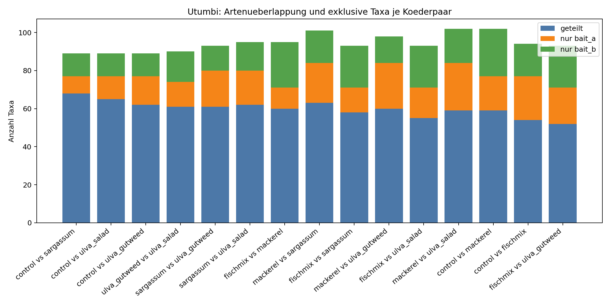
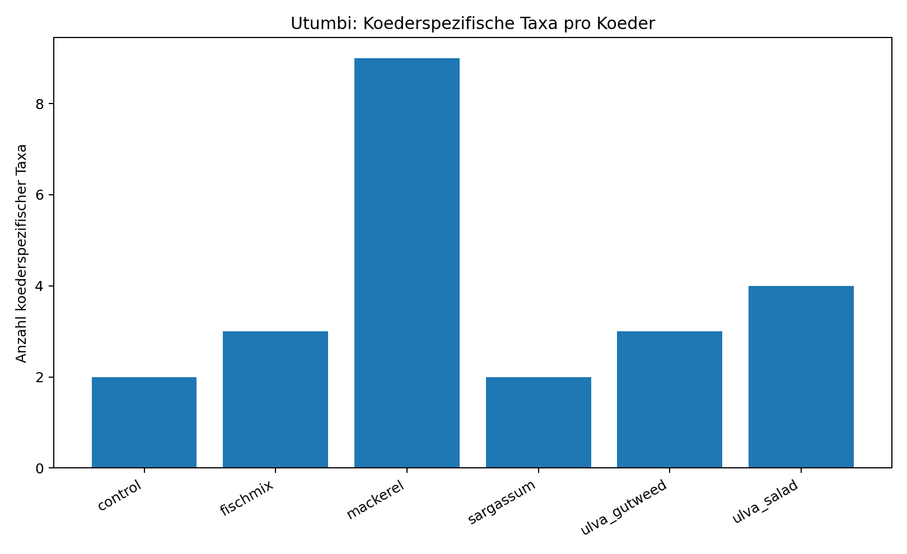

# Artenvergleich Koeder - Utumbi (cut_47min)

## Datengrundlage
- Standort: utumbi
- Anzahl Videos: 18
- Koeder: control, fischmix, mackerel, sargassum, ulva_gutweed, ulva_salad
- Taxonbildung: species > genus > family/label; feeding/interested ausgeschlossen

## Kurzfazit
- Hoechste Ueberlappung: control vs sargassum (Jaccard=0.764, geteilt=68).
- Taxa, die in allen Koedern dieses Standorts vorkommen: 43

## Koederpaare im Vergleich
| bait_a       | bait_b       |   n_taxa_a |   n_taxa_b |   intersection_taxa |   union_taxa |   jaccard_similarity |   jaccard_distance |   unique_a |   unique_b |
|:-------------|:-------------|-----------:|-----------:|--------------------:|-------------:|---------------------:|-------------------:|-----------:|-----------:|
| control      | sargassum    |         77 |         80 |                  68 |           89 |             0.764045 |           0.235955 |          9 |         12 |
| control      | ulva_salad   |         77 |         77 |                  65 |           89 |             0.730337 |           0.269663 |         12 |         12 |
| control      | ulva_gutweed |         77 |         74 |                  62 |           89 |             0.696629 |           0.303371 |         15 |         12 |
| ulva_gutweed | ulva_salad   |         74 |         77 |                  61 |           90 |             0.677778 |           0.322222 |         13 |         16 |
| sargassum    | ulva_gutweed |         80 |         74 |                  61 |           93 |             0.655914 |           0.344086 |         19 |         13 |
| sargassum    | ulva_salad   |         80 |         77 |                  62 |           95 |             0.652632 |           0.347368 |         18 |         15 |
| fischmix     | mackerel     |         71 |         84 |                  60 |           95 |             0.631579 |           0.368421 |         11 |         24 |
| mackerel     | sargassum    |         84 |         80 |                  63 |          101 |             0.623762 |           0.376238 |         21 |         17 |
| fischmix     | sargassum    |         71 |         80 |                  58 |           93 |             0.623656 |           0.376344 |         13 |         22 |
| mackerel     | ulva_gutweed |         84 |         74 |                  60 |           98 |             0.612245 |           0.387755 |         24 |         14 |
| fischmix     | ulva_salad   |         71 |         77 |                  55 |           93 |             0.591398 |           0.408602 |         16 |         22 |
| mackerel     | ulva_salad   |         84 |         77 |                  59 |          102 |             0.578431 |           0.421569 |         25 |         18 |
| control      | mackerel     |         77 |         84 |                  59 |          102 |             0.578431 |           0.421569 |         18 |         25 |
| control      | fischmix     |         77 |         71 |                  54 |           94 |             0.574468 |           0.425532 |         23 |         17 |
| fischmix     | ulva_gutweed |         71 |         74 |                  52 |           93 |             0.55914  |           0.44086  |         19 |         22 |

## Koederspezifische Taxa (Anzahl)
| koeder       |   n_bait_specific_taxa |   n_videos |
|:-------------|-----------------------:|-----------:|
| mackerel     |                      9 |          3 |
| ulva_salad   |                      4 |          3 |
| ulva_gutweed |                      3 |          3 |
| fischmix     |                      3 |          2 |
| control      |                      2 |          4 |
| sargassum    |                      2 |          3 |

## Vollstaendige Listen koederspezifischer Taxa

### control (2 Taxa)
- species::potato (epinephelus tukula)
- species::threespot (apolemichthys trimaculatus)

### fischmix (3 Taxa)
- family_label::triggerfishes (balistidae)
- species::cigar (cheilio inermis)
- species::longnose (lethrinus olivaceus)

### mackerel (9 Taxa)
- family_label::wrasses interested
- species::brassy trevally (caranx papuensis)
- species::chevroned (chaetodon trifascialis)
- species::indian half-and-half (pycnochromis dimidiatusf)
- species::monk (acanthurus gahhm)
- species::peacock (cephalopholis argus)
- species::queenfish (scomberoides lysan)
- species::scrawled (aluterus scriptus)
- species::spot-tail (coris caudimacula)

### sargassum (2 Taxa)
- species::lined (chaetodon lineolatus)
- species::yellowtail (anampses meleagrides)

### ulva_gutweed (3 Taxa)
- family_label::scorpion-&lionfishes (scorpaenidae)
- genus::genus ctenochaetus
- species::halfmoon (sufflamen chrysopterum)

### ulva_salad (4 Taxa)
- family_label::jacks/trevallyes (carangidae)
- family_label::naso feeding
- species::clown (coris aygula)
- species::emperor (pomacanthus imperator)

## Praesenzmuster ueber Koeder
|   presence_pattern |   n_taxa |
|-------------------:|---------:|
|             111111 |       43 |
|             001000 |        9 |
|             000001 |        4 |
|             100111 |        4 |
|             111101 |        4 |
|             101111 |        4 |
|             011000 |        4 |
|             000010 |        3 |
|             100101 |        3 |
|             101011 |        3 |
|             010000 |        3 |
|             000100 |        2 |
|             111110 |        2 |
|             110100 |        2 |
|             011100 |        2 |

## Grafiken
- ../figures/utumbi/pairwise_shared_unique_taxa.png
- ../figures/utumbi/taxa_presence_patterns.png
- ../figures/utumbi/bait_specific_taxa_counts.png

### Abbildungen

