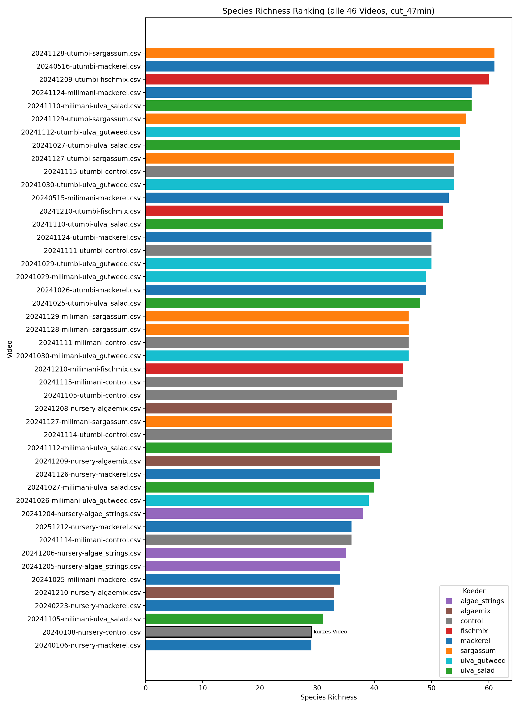
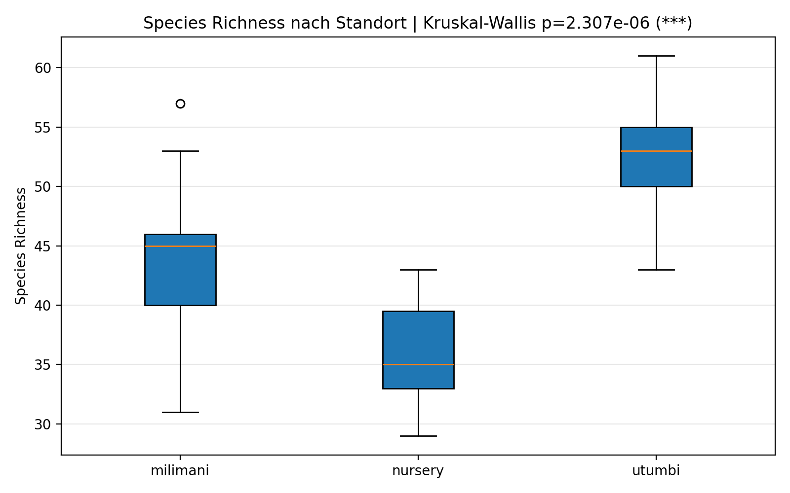
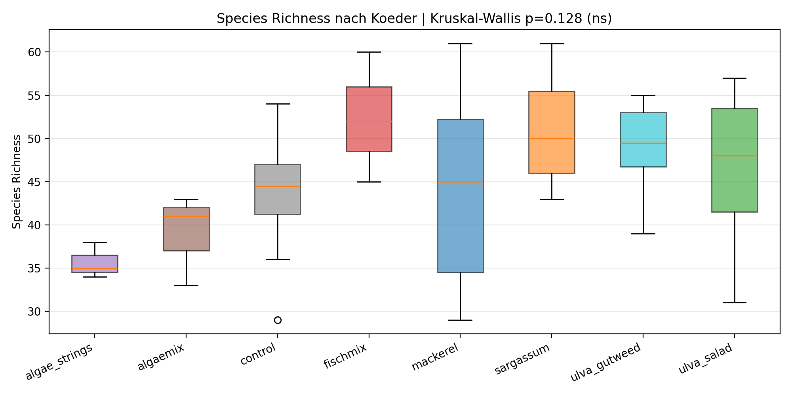
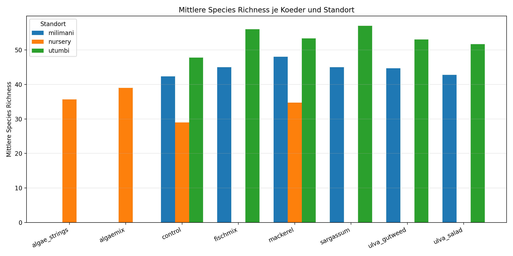

# Species Richness Analyse (cut_47min, alle 46 Videos)

## Kurze Zusammenfassung
Die Analyse umfasst 46 cut_47min-Videos. Der globale Standorteffekt ist signifikant (p=2.307e-06), waehrend der globale Koedereffekt nicht signifikant ist (p=0.128). Das kuerzere Sondervideo 20240108-nursery-control.csv ist durchgehend markiert.

## Methode zur Berechnung der Species Richness
- Datengrundlage: `normalized_reports/cut_47min/*/*.csv` (46 Videos).
- Labels mit `feeding=TRUE` oder `interested=TRUE` wurden ignoriert.
- Gezaehlte Taxon-Einheit pro Zeile:
  1. `species`, falls vorhanden.
  2. sonst `genus`.
  3. sonst naechste Hierarchiestufe (`family` bzw. `label_name`, z.B. Parrotfishes).
  4. sonst `label_name`.
- Species Richness pro Video = Anzahl eindeutiger Taxon-Einheiten.

## Farblegende fuer Koeder
| koeder        | marker   | hex     |
|:--------------|:---------|:--------|
| algae_strings | 🟣        | #9467bd |
| algaemix      | 🟤        | #8c564b |
| control       | ⚪        | #7f7f7f |
| fischmix      | 🔴        | #d62728 |
| mackerel      | 🔵        | #1f77b4 |
| sargassum     | 🟠        | #ff7f0e |
| ulva_gutweed  | 🩵        | #17becf |
| ulva_salad    | 🟢        | #2ca02c |

## Uebersicht: Videos nach Standort und Koeder (gleichfarbig ueber Marker)
### Standort: milimani
#### Koeder: control
| video                         | koeder_farbe   |   species_richness |   rows_used |   rows_total | kuerzestes_video   |
|:------------------------------|:---------------|-------------------:|------------:|-------------:|:-------------------|
| 20241111-milimani-control.csv | ⚪              |                 46 |         334 |          334 | Nein               |
| 20241115-milimani-control.csv | ⚪              |                 45 |         148 |          148 | Nein               |
| 20241114-milimani-control.csv | ⚪              |                 36 |         180 |          180 | Nein               |

#### Koeder: fischmix
| video                          | koeder_farbe   |   species_richness |   rows_used |   rows_total | kuerzestes_video   |
|:-------------------------------|:---------------|-------------------:|------------:|-------------:|:-------------------|
| 20241210-milimani-fischmix.csv | 🔴              |                 45 |         379 |          409 | Nein               |

#### Koeder: mackerel
| video                          | koeder_farbe   |   species_richness |   rows_used |   rows_total | kuerzestes_video   |
|:-------------------------------|:---------------|-------------------:|------------:|-------------:|:-------------------|
| 20241124-milimani-mackerel.csv | 🔵              |                 57 |         261 |          287 | Nein               |
| 20240515-milimani-mackerel.csv | 🔵              |                 53 |         375 |          375 | Nein               |
| 20241025-milimani-mackerel.csv | 🔵              |                 34 |         259 |          259 | Nein               |

#### Koeder: sargassum
| video                           | koeder_farbe   |   species_richness |   rows_used |   rows_total | kuerzestes_video   |
|:--------------------------------|:---------------|-------------------:|------------:|-------------:|:-------------------|
| 20241128-milimani-sargassum.csv | 🟠              |                 46 |         380 |          391 | Nein               |
| 20241129-milimani-sargassum.csv | 🟠              |                 46 |         314 |          320 | Nein               |
| 20241127-milimani-sargassum.csv | 🟠              |                 43 |         205 |          214 | Nein               |

#### Koeder: ulva_gutweed
| video                              | koeder_farbe   |   species_richness |   rows_used |   rows_total | kuerzestes_video   |
|:-----------------------------------|:---------------|-------------------:|------------:|-------------:|:-------------------|
| 20241029-milimani-ulva_gutweed.csv | 🩵              |                 49 |         149 |          149 | Nein               |
| 20241030-milimani-ulva_gutweed.csv | 🩵              |                 46 |         181 |          181 | Nein               |
| 20241026-milimani-ulva_gutweed.csv | 🩵              |                 39 |         126 |          128 | Nein               |

#### Koeder: ulva_salad
| video                            | koeder_farbe   |   species_richness |   rows_used |   rows_total | kuerzestes_video   |
|:---------------------------------|:---------------|-------------------:|------------:|-------------:|:-------------------|
| 20241110-milimani-ulva_salad.csv | 🟢              |                 57 |         320 |          320 | Nein               |
| 20241112-milimani-ulva_salad.csv | 🟢              |                 43 |         268 |          268 | Nein               |
| 20241027-milimani-ulva_salad.csv | 🟢              |                 40 |         105 |          106 | Nein               |
| 20241105-milimani-ulva_salad.csv | 🟢              |                 31 |         100 |          100 | Nein               |

### Standort: nursery
#### Koeder: algae_strings
| video                              | koeder_farbe   |   species_richness |   rows_used |   rows_total | kuerzestes_video   |
|:-----------------------------------|:---------------|-------------------:|------------:|-------------:|:-------------------|
| 20241204-nursery-algae_strings.csv | 🟣              |                 38 |         200 |          224 | Nein               |
| 20241206-nursery-algae_strings.csv | 🟣              |                 35 |         157 |          168 | Nein               |
| 20241205-nursery-algae_strings.csv | 🟣              |                 34 |         190 |          204 | Nein               |

#### Koeder: algaemix
| video                         | koeder_farbe   |   species_richness |   rows_used |   rows_total | kuerzestes_video   |
|:------------------------------|:---------------|-------------------:|------------:|-------------:|:-------------------|
| 20241208-nursery-algaemix.csv | 🟤              |                 43 |         340 |          420 | Nein               |
| 20241209-nursery-algaemix.csv | 🟤              |                 41 |         283 |          303 | Nein               |
| 20241210-nursery-algaemix.csv | 🟤              |                 33 |         170 |          201 | Nein               |

#### Koeder: control
| video                        | koeder_farbe   |   species_richness |   rows_used |   rows_total | kuerzestes_video   |
|:-----------------------------|:---------------|-------------------:|------------:|-------------:|:-------------------|
| 20240108-nursery-control.csv | ⚪              |                 29 |          69 |           69 | 🟥 Ja               |

#### Koeder: mackerel
| video                         | koeder_farbe   |   species_richness |   rows_used |   rows_total | kuerzestes_video   |
|:------------------------------|:---------------|-------------------:|------------:|-------------:|:-------------------|
| 20241126-nursery-mackerel.csv | 🔵              |                 41 |         356 |          361 | Nein               |
| 20251212-nursery-mackerel.csv | 🔵              |                 36 |         150 |          159 | Nein               |
| 20240223-nursery-mackerel.csv | 🔵              |                 33 |         192 |          211 | Nein               |
| 20240106-nursery-mackerel.csv | 🔵              |                 29 |         103 |          107 | Nein               |

### Standort: utumbi
#### Koeder: control
| video                       | koeder_farbe   |   species_richness |   rows_used |   rows_total | kuerzestes_video   |
|:----------------------------|:---------------|-------------------:|------------:|-------------:|:-------------------|
| 20241115-utumbi-control.csv | ⚪              |                 54 |         235 |          235 | Nein               |
| 20241111-utumbi-control.csv | ⚪              |                 50 |         219 |          219 | Nein               |
| 20241105-utumbi-control.csv | ⚪              |                 44 |         396 |          398 | Nein               |
| 20241114-utumbi-control.csv | ⚪              |                 43 |         135 |          135 | Nein               |

#### Koeder: fischmix
| video                        | koeder_farbe   |   species_richness |   rows_used |   rows_total | kuerzestes_video   |
|:-----------------------------|:---------------|-------------------:|------------:|-------------:|:-------------------|
| 20241209-utumbi-fischmix.csv | 🔴              |                 60 |         317 |          373 | Nein               |
| 20241210-utumbi-fischmix.csv | 🔴              |                 52 |         222 |          249 | Nein               |

#### Koeder: mackerel
| video                        | koeder_farbe   |   species_richness |   rows_used |   rows_total | kuerzestes_video   |
|:-----------------------------|:---------------|-------------------:|------------:|-------------:|:-------------------|
| 20240516-utumbi-mackerel.csv | 🔵              |                 61 |         518 |          529 | Nein               |
| 20241124-utumbi-mackerel.csv | 🔵              |                 50 |         294 |          343 | Nein               |
| 20241026-utumbi-mackerel.csv | 🔵              |                 49 |         366 |          395 | Nein               |

#### Koeder: sargassum
| video                         | koeder_farbe   |   species_richness |   rows_used |   rows_total | kuerzestes_video   |
|:------------------------------|:---------------|-------------------:|------------:|-------------:|:-------------------|
| 20241128-utumbi-sargassum.csv | 🟠              |                 61 |         233 |          235 | Nein               |
| 20241129-utumbi-sargassum.csv | 🟠              |                 56 |         245 |          251 | Nein               |
| 20241127-utumbi-sargassum.csv | 🟠              |                 54 |         281 |          293 | Nein               |

#### Koeder: ulva_gutweed
| video                            | koeder_farbe   |   species_richness |   rows_used |   rows_total | kuerzestes_video   |
|:---------------------------------|:---------------|-------------------:|------------:|-------------:|:-------------------|
| 20241112-utumbi-ulva_gutweed.csv | 🩵              |                 55 |         212 |          213 | Nein               |
| 20241030-utumbi-ulva_gutweed.csv | 🩵              |                 54 |         227 |          227 | Nein               |
| 20241029-utumbi-ulva_gutweed.csv | 🩵              |                 50 |         365 |          367 | Nein               |

#### Koeder: ulva_salad
| video                          | koeder_farbe   |   species_richness |   rows_used |   rows_total | kuerzestes_video   |
|:-------------------------------|:---------------|-------------------:|------------:|-------------:|:-------------------|
| 20241027-utumbi-ulva_salad.csv | 🟢              |                 55 |         376 |          381 | Nein               |
| 20241110-utumbi-ulva_salad.csv | 🟢              |                 52 |         308 |          316 | Nein               |
| 20241025-utumbi-ulva_salad.csv | 🟢              |                 48 |         525 |          527 | Nein               |

## Ranking aller 46 Videos (nicht nur Top 10)
|   rank | filename                           | standort   | koeder        | koeder_farbe   |   species_richness | kuerzestes_video   |
|-------:|:-----------------------------------|:-----------|:--------------|:---------------|-------------------:|:-------------------|
|      1 | 20240516-utumbi-mackerel.csv       | utumbi     | mackerel      | 🔵              |                 61 | Nein               |
|      2 | 20241128-utumbi-sargassum.csv      | utumbi     | sargassum     | 🟠              |                 61 | Nein               |
|      3 | 20241209-utumbi-fischmix.csv       | utumbi     | fischmix      | 🔴              |                 60 | Nein               |
|      4 | 20241110-milimani-ulva_salad.csv   | milimani   | ulva_salad    | 🟢              |                 57 | Nein               |
|      5 | 20241124-milimani-mackerel.csv     | milimani   | mackerel      | 🔵              |                 57 | Nein               |
|      6 | 20241129-utumbi-sargassum.csv      | utumbi     | sargassum     | 🟠              |                 56 | Nein               |
|      7 | 20241027-utumbi-ulva_salad.csv     | utumbi     | ulva_salad    | 🟢              |                 55 | Nein               |
|      8 | 20241112-utumbi-ulva_gutweed.csv   | utumbi     | ulva_gutweed  | 🩵              |                 55 | Nein               |
|      9 | 20241030-utumbi-ulva_gutweed.csv   | utumbi     | ulva_gutweed  | 🩵              |                 54 | Nein               |
|     10 | 20241115-utumbi-control.csv        | utumbi     | control       | ⚪              |                 54 | Nein               |
|     11 | 20241127-utumbi-sargassum.csv      | utumbi     | sargassum     | 🟠              |                 54 | Nein               |
|     12 | 20240515-milimani-mackerel.csv     | milimani   | mackerel      | 🔵              |                 53 | Nein               |
|     13 | 20241110-utumbi-ulva_salad.csv     | utumbi     | ulva_salad    | 🟢              |                 52 | Nein               |
|     14 | 20241210-utumbi-fischmix.csv       | utumbi     | fischmix      | 🔴              |                 52 | Nein               |
|     15 | 20241029-utumbi-ulva_gutweed.csv   | utumbi     | ulva_gutweed  | 🩵              |                 50 | Nein               |
|     16 | 20241111-utumbi-control.csv        | utumbi     | control       | ⚪              |                 50 | Nein               |
|     17 | 20241124-utumbi-mackerel.csv       | utumbi     | mackerel      | 🔵              |                 50 | Nein               |
|     18 | 20241026-utumbi-mackerel.csv       | utumbi     | mackerel      | 🔵              |                 49 | Nein               |
|     19 | 20241029-milimani-ulva_gutweed.csv | milimani   | ulva_gutweed  | 🩵              |                 49 | Nein               |
|     20 | 20241025-utumbi-ulva_salad.csv     | utumbi     | ulva_salad    | 🟢              |                 48 | Nein               |
|     21 | 20241030-milimani-ulva_gutweed.csv | milimani   | ulva_gutweed  | 🩵              |                 46 | Nein               |
|     22 | 20241111-milimani-control.csv      | milimani   | control       | ⚪              |                 46 | Nein               |
|     23 | 20241128-milimani-sargassum.csv    | milimani   | sargassum     | 🟠              |                 46 | Nein               |
|     24 | 20241129-milimani-sargassum.csv    | milimani   | sargassum     | 🟠              |                 46 | Nein               |
|     25 | 20241115-milimani-control.csv      | milimani   | control       | ⚪              |                 45 | Nein               |
|     26 | 20241210-milimani-fischmix.csv     | milimani   | fischmix      | 🔴              |                 45 | Nein               |
|     27 | 20241105-utumbi-control.csv        | utumbi     | control       | ⚪              |                 44 | Nein               |
|     28 | 20241112-milimani-ulva_salad.csv   | milimani   | ulva_salad    | 🟢              |                 43 | Nein               |
|     29 | 20241114-utumbi-control.csv        | utumbi     | control       | ⚪              |                 43 | Nein               |
|     30 | 20241127-milimani-sargassum.csv    | milimani   | sargassum     | 🟠              |                 43 | Nein               |
|     31 | 20241208-nursery-algaemix.csv      | nursery    | algaemix      | 🟤              |                 43 | Nein               |
|     32 | 20241126-nursery-mackerel.csv      | nursery    | mackerel      | 🔵              |                 41 | Nein               |
|     33 | 20241209-nursery-algaemix.csv      | nursery    | algaemix      | 🟤              |                 41 | Nein               |
|     34 | 20241027-milimani-ulva_salad.csv   | milimani   | ulva_salad    | 🟢              |                 40 | Nein               |
|     35 | 20241026-milimani-ulva_gutweed.csv | milimani   | ulva_gutweed  | 🩵              |                 39 | Nein               |
|     36 | 20241204-nursery-algae_strings.csv | nursery    | algae_strings | 🟣              |                 38 | Nein               |
|     37 | 20241114-milimani-control.csv      | milimani   | control       | ⚪              |                 36 | Nein               |
|     38 | 20251212-nursery-mackerel.csv      | nursery    | mackerel      | 🔵              |                 36 | Nein               |
|     39 | 20241206-nursery-algae_strings.csv | nursery    | algae_strings | 🟣              |                 35 | Nein               |
|     40 | 20241025-milimani-mackerel.csv     | milimani   | mackerel      | 🔵              |                 34 | Nein               |
|     41 | 20241205-nursery-algae_strings.csv | nursery    | algae_strings | 🟣              |                 34 | Nein               |
|     42 | 20240223-nursery-mackerel.csv      | nursery    | mackerel      | 🔵              |                 33 | Nein               |
|     43 | 20241210-nursery-algaemix.csv      | nursery    | algaemix      | 🟤              |                 33 | Nein               |
|     44 | 20241105-milimani-ulva_salad.csv   | milimani   | ulva_salad    | 🟢              |                 31 | Nein               |
|     45 | 20240106-nursery-mackerel.csv      | nursery    | mackerel      | 🔵              |                 29 | Nein               |
|     46 | 20240108-nursery-control.csv       | nursery    | control       | ⚪              |                 29 | 🟥 Ja               |

## Gruppenstatistik (Standort x Koeder)
| standort   | koeder        |   n_videos |   mean_species_richness |   median_species_richness |   sd_species_richness |   min_species_richness |   max_species_richness |
|:-----------|:--------------|-----------:|------------------------:|--------------------------:|----------------------:|-----------------------:|-----------------------:|
| milimani   | control       |          3 |                 42.3333 |                      45   |               5.50757 |                     36 |                     46 |
| milimani   | fischmix      |          1 |                 45      |                      45   |               0       |                     45 |                     45 |
| milimani   | mackerel      |          3 |                 48      |                      53   |              12.2882  |                     34 |                     57 |
| milimani   | sargassum     |          3 |                 45      |                      46   |               1.73205 |                     43 |                     46 |
| milimani   | ulva_gutweed  |          3 |                 44.6667 |                      46   |               5.1316  |                     39 |                     49 |
| milimani   | ulva_salad    |          4 |                 42.75   |                      41.5 |              10.7819  |                     31 |                     57 |
| nursery    | algae_strings |          3 |                 35.6667 |                      35   |               2.08167 |                     34 |                     38 |
| nursery    | algaemix      |          3 |                 39      |                      41   |               5.2915  |                     33 |                     43 |
| nursery    | control       |          1 |                 29      |                      29   |               0       |                     29 |                     29 |
| nursery    | mackerel      |          4 |                 34.75   |                      34.5 |               5.058   |                     29 |                     41 |
| utumbi     | control       |          4 |                 47.75   |                      47   |               5.18813 |                     43 |                     54 |
| utumbi     | fischmix      |          2 |                 56      |                      56   |               5.65685 |                     52 |                     60 |
| utumbi     | mackerel      |          3 |                 53.3333 |                      50   |               6.65833 |                     49 |                     61 |
| utumbi     | sargassum     |          3 |                 57      |                      56   |               3.60555 |                     54 |                     61 |
| utumbi     | ulva_gutweed  |          3 |                 53      |                      54   |               2.64575 |                     50 |                     55 |
| utumbi     | ulva_salad    |          3 |                 51.6667 |                      52   |               3.51188 |                     48 |                     55 |

## Signifikanztests
### Globale Tests (Kruskal-Wallis)
| Analyse                   | Gruppen                                                                                   |       H |          p | Signifikant (p<0.05)   | Hinweis   |
|:--------------------------|:------------------------------------------------------------------------------------------|--------:|-----------:|:-----------------------|:----------|
| Kruskal-Wallis (standort) | milimani, nursery, utumbi                                                                 | 25.9593 | 2.3068e-06 | Ja                     |           |
| Kruskal-Wallis (koeder)   | algae_strings, algaemix, control, fischmix, mackerel, sargassum, ulva_gutweed, ulva_salad | 11.2522 | 0.127989   | Nein                   |           |

### Paarweise Standortvergleiche (Mann-Whitney U, Holm-korrigiert)
| group_a   | group_b   |   n_a |   n_b |   u_stat |    p_value |   p_value_holm | significant_0_05   | significant_0_05_holm   |
|:----------|:----------|------:|------:|---------:|-----------:|---------------:|:-------------------|:------------------------|
| nursery   | utumbi    |    11 |    18 |      0.5 | 1.0198e-05 |     3.0594e-05 | Ja                 | Ja                      |
| milimani  | utumbi    |    17 |    18 |     55.5 | 0.00133767 |     0.00267534 | Ja                 | Ja                      |
| milimani  | nursery   |    17 |    11 |    160   | 0.00184804 |     0.00267534 | Ja                 | Ja                      |

### Paarweise Koedervergleiche (Mann-Whitney U, Holm-korrigiert)
| group_a       | group_b      |   n_a |   n_b |   u_stat |   p_value |   p_value_holm | significant_0_05   | significant_0_05_holm   |
|:--------------|:-------------|------:|------:|---------:|----------:|---------------:|:-------------------|:------------------------|
| algae_strings | ulva_gutweed |     3 |     6 |      0   | 0.0238095 |       0.666667 | Ja                 | Nein                    |
| algae_strings | sargassum    |     3 |     6 |      0   | 0.0275319 |       0.743361 | Ja                 | Nein                    |
| algaemix      | sargassum    |     3 |     6 |      0.5 | 0.0372492 |       0.968478 | Ja                 | Nein                    |
| algaemix      | ulva_gutweed |     3 |     6 |      2   | 0.0952381 |       1        | Nein               | Nein                    |
| algae_strings | fischmix     |     3 |     3 |      0   | 0.1       |       1        | Nein               | Nein                    |
| algaemix      | fischmix     |     3 |     3 |      0   | 0.1       |       1        | Nein               | Nein                    |
| control       | sargassum    |     8 |     6 |     11   | 0.104271  |       1        | Nein               | Nein                    |
| algae_strings | ulva_salad   |     3 |     7 |      3   | 0.116667  |       1        | Nein               | Nein                    |
| algae_strings | control      |     3 |     8 |      4   | 0.133333  |       1        | Nein               | Nein                    |
| control       | fischmix     |     8 |     3 |      4.5 | 0.152107  |       1        | Nein               | Nein                    |
| control       | ulva_gutweed |     8 |     6 |     12.5 | 0.154215  |       1        | Nein               | Nein                    |
| algaemix      | control      |     3 |     8 |      5.5 | 0.21962   |       1        | Nein               | Nein                    |
| mackerel      | sargassum    |    10 |     6 |     19.5 | 0.277368  |       1        | Nein               | Nein                    |
| algaemix      | ulva_salad   |     3 |     7 |      5.5 | 0.303589  |       1        | Nein               | Nein                    |
| fischmix      | mackerel     |     3 |    10 |     21   | 0.370629  |       1        | Nein               | Nein                    |
| algae_strings | mackerel     |     3 |    10 |      9.5 | 0.397376  |       1        | Nein               | Nein                    |
| fischmix      | ulva_salad   |     3 |     7 |     14.5 | 0.423622  |       1        | Nein               | Nein                    |
| sargassum     | ulva_salad   |     6 |     7 |     26.5 | 0.473833  |       1        | Nein               | Nein                    |
| mackerel      | ulva_gutweed |    10 |     6 |     23   | 0.480149  |       1        | Nein               | Nein                    |
| control       | ulva_salad   |     8 |     7 |     21.5 | 0.487064  |       1        | Nein               | Nein                    |
| algaemix      | mackerel     |     3 |    10 |     11   | 0.553021  |       1        | Nein               | Nein                    |
| algae_strings | algaemix     |     3 |     3 |      3   | 0.7       |       1        | Nein               | Nein                    |
| fischmix      | ulva_gutweed |     3 |     6 |     11   | 0.714286  |       1        | Nein               | Nein                    |
| sargassum     | ulva_gutweed |     6 |     6 |     20.5 | 0.746625  |       1        | Nein               | Nein                    |
| mackerel      | ulva_salad   |    10 |     7 |     31.5 | 0.769561  |       1        | Nein               | Nein                    |
| ulva_gutweed  | ulva_salad   |     6 |     7 |     22.5 | 0.886248  |       1        | Nein               | Nein                    |
| control       | mackerel     |     8 |    10 |     38.5 | 0.92909   |       1        | Nein               | Nein                    |
| fischmix      | sargassum    |     3 |     6 |      9   | 1         |       1        | Nein               | Nein                    |

### Standortgetrennte Koeder-Signifikanz (global je Standort)
| standort   | test                    | groups                                                           |   h_stat |   p_value | significant_0_05   | note   |
|:-----------|:------------------------|:-----------------------------------------------------------------|---------:|----------:|:-------------------|:-------|
| milimani   | Kruskal-Wallis (koeder) | control, mackerel, sargassum, ulva_gutweed, ulva_salad           |  1.3024  |  0.860969 | Nein               |        |
| nursery    | Kruskal-Wallis (koeder) | algae_strings, algaemix, mackerel                                |  1.19632 |  0.549823 | Nein               |        |
| utumbi     | Kruskal-Wallis (koeder) | control, fischmix, mackerel, sargassum, ulva_gutweed, ulva_salad |  6.2774  |  0.280155 | Nein               |        |

### Standortgetrennte paarweise Koedervergleiche (Holm-korrigiert)
| standort   | group_a       | group_b      |   n_a |   n_b |   u_stat |   p_value |   p_value_holm | significant_0_05   | significant_0_05_holm   |
|:-----------|:--------------|:-------------|------:|------:|---------:|----------:|---------------:|:-------------------|:------------------------|
| milimani   | sargassum     | ulva_salad   |     3 |     4 |      8.5 | 0.471474  |              1 | Nein               | Nein                    |
| milimani   | control       | ulva_gutweed |     3 |     3 |      2.5 | 0.506555  |              1 | Nein               | Nein                    |
| milimani   | control       | sargassum    |     3 |     3 |      3   | 0.642835  |              1 | Nein               | Nein                    |
| milimani   | mackerel      | sargassum    |     3 |     3 |      6   | 0.657905  |              1 | Nein               | Nein                    |
| milimani   | control       | mackerel     |     3 |     3 |      3   | 0.7       |              1 | Nein               | Nein                    |
| milimani   | mackerel      | ulva_gutweed |     3 |     3 |      6   | 0.7       |              1 | Nein               | Nein                    |
| milimani   | mackerel      | ulva_salad   |     3 |     4 |      7.5 | 0.721277  |              1 | Nein               | Nein                    |
| milimani   | control       | ulva_salad   |     3 |     4 |      7   | 0.857143  |              1 | Nein               | Nein                    |
| milimani   | ulva_gutweed  | ulva_salad   |     3 |     4 |      7   | 0.857143  |              1 | Nein               | Nein                    |
| milimani   | sargassum     | ulva_gutweed |     3 |     3 |      4   | 1         |              1 | Nein               | Nein                    |
| nursery    | algaemix      | mackerel     |     3 |     4 |      9   | 0.368066  |              1 | Nein               | Nein                    |
| nursery    | algae_strings | algaemix     |     3 |     3 |      3   | 0.7       |              1 | Nein               | Nein                    |
| nursery    | algae_strings | mackerel     |     3 |     4 |      7   | 0.857143  |              1 | Nein               | Nein                    |
| utumbi     | control       | sargassum    |     4 |     3 |      0.5 | 0.0744618 |              1 | Nein               | Nein                    |
| utumbi     | sargassum     | ulva_salad   |     3 |     3 |      8   | 0.2       |              1 | Nein               | Nein                    |
| utumbi     | control       | ulva_gutweed |     4 |     3 |      2   | 0.207617  |              1 | Nein               | Nein                    |
| utumbi     | control       | fischmix     |     4 |     2 |      1   | 0.266667  |              1 | Nein               | Nein                    |
| utumbi     | sargassum     | ulva_gutweed |     3 |     3 |      7.5 | 0.268286  |              1 | Nein               | Nein                    |
| utumbi     | control       | ulva_salad   |     4 |     3 |      3   | 0.4       |              1 | Nein               | Nein                    |
| utumbi     | control       | mackerel     |     4 |     3 |      3.5 | 0.475533  |              1 | Nein               | Nein                    |
| utumbi     | mackerel      | sargassum    |     3 |     3 |      2.5 | 0.506555  |              1 | Nein               | Nein                    |
| utumbi     | fischmix      | ulva_salad   |     2 |     3 |      4.5 | 0.553617  |              1 | Nein               | Nein                    |
| utumbi     | fischmix      | mackerel     |     2 |     3 |      4   | 0.8       |              1 | Nein               | Nein                    |
| utumbi     | fischmix      | sargassum    |     2 |     3 |      2   | 0.8       |              1 | Nein               | Nein                    |
| utumbi     | fischmix      | ulva_gutweed |     2 |     3 |      4   | 0.8       |              1 | Nein               | Nein                    |
| utumbi     | mackerel      | ulva_gutweed |     3 |     3 |      3.5 | 0.824778  |              1 | Nein               | Nein                    |
| utumbi     | ulva_gutweed  | ulva_salad   |     3 |     3 |      5.5 | 0.824778  |              1 | Nein               | Nein                    |
| utumbi     | mackerel      | ulva_salad   |     3 |     3 |      5   | 1         |              1 | Nein               | Nein                    |

## Grafiken
- 
- 
- 
- 

## Hinweise
- Signifikanzniveau: alpha = 0.05.
- Nach Holm-Korrektur sind fuer Koeder keine paarweisen Vergleiche signifikant.
