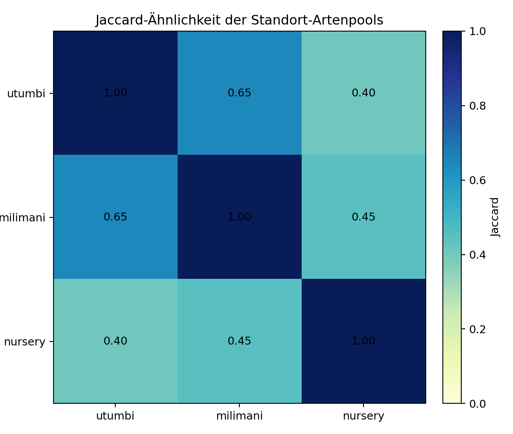
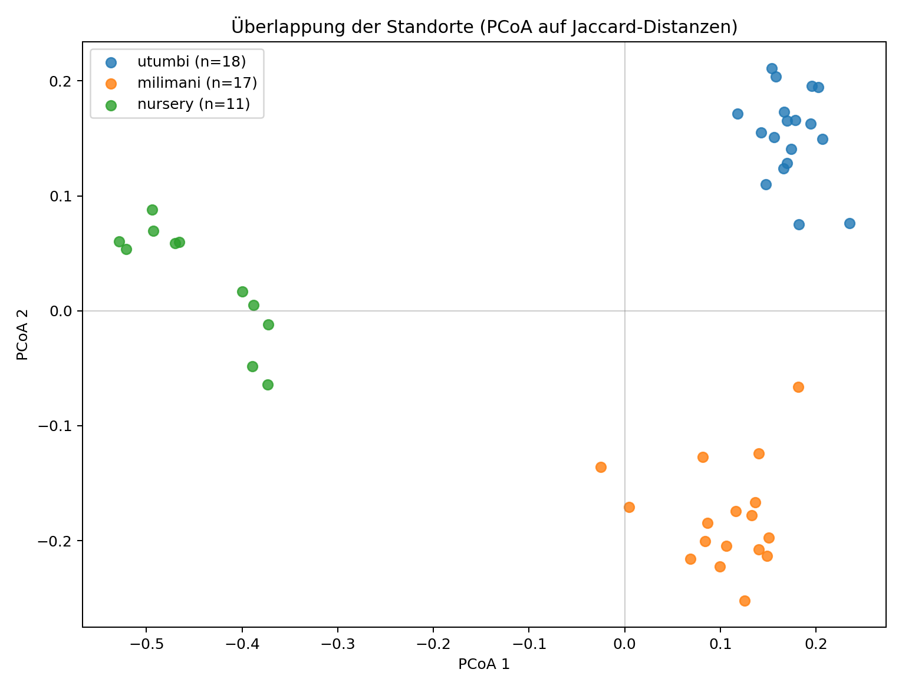
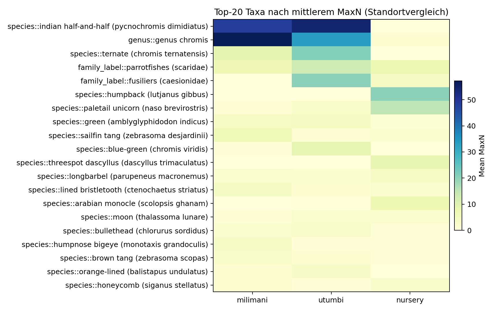
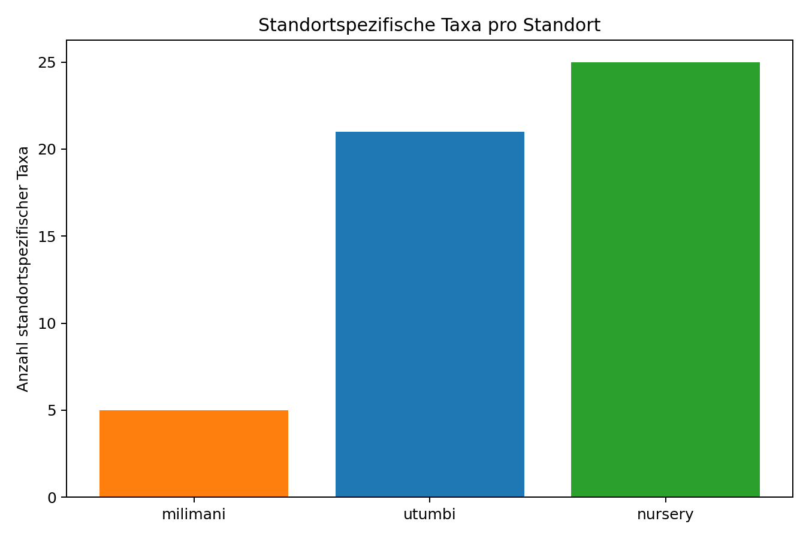
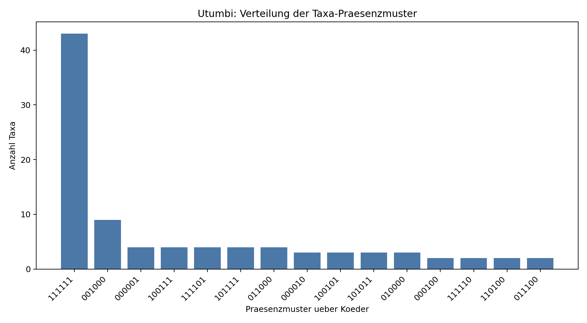

# Praesentationsvorlage: Statistische Tests und wichtigste Ergebnisse

Diese Datei ist als langes, direkt nutzbares Geruest fuer eine Praesentation gedacht. Sie fasst die verwendeten statistischen Tests, die zentralen Ergebnisse und die wichtigsten Interpretationspunkte aus den Analysen zusammen.

## 1. Kurzfassung fuer den Einstieg

Die Daten zeigen ein klares, aber je nach Analyseebene unterschiedlich starkes Muster:

- Auf Standortebene unterscheiden sich die Fischgemeinschaften deutlich in der Taxa-Haeufigkeit (MaxN).
- Auf Koeder-Ebene ist die Zusammensetzung der Taxa pro Standort zwar global unterschiedlich, aber einzelne Koederpaare bleiben nach Holm-Korrektur meist nicht signifikant.
- Die Verhaltensannotationen `feeding` und `interested` sind miteinander verwandt, aber nicht identisch. Sie zeigen teils ueberschneidende, teils standortspezifische Signale.
- In einer fokussierten Nursery-Sensitivitaet (`algaemix` vs `mackerel`, Feeding, 2 vordefinierte Taxa) zeigen sich sehr starke Effekte; Holm bleibt knapp ueber 0.05, BH ist signifikant.
- Auch strengere Sensitivitaetsanalysen fuehren nicht zu neuen robusten Taxa-Effekten; die Hauptergebnisse bleiben stabil.

## 2. Welche statistischen Tests wurden durchgefuehrt?

### 2.1 Uebersicht der Testarten

| Test / Verfahren | Wofuer verwendet? | Effektgroesse / Zusatzinfo | Kernaussage im Projekt |
|:--|:--|:--|:--|
| Kruskal-Wallis-Test | Taxa-Haeufigkeiten (MaxN) zwischen Standorten oder Koedern | `eta_sq` bzw. Rangunterschiede | Testet, ob sich die Verteilung der MaxN-Werte zwischen Gruppen unterscheidet |
| Holm-Korrektur | Mehrfachtest-Korrektur ueber viele Taxa oder Paarvergleiche | konservative Familienfehler-Kontrolle | Entscheidet, welche Rohsignale als robust gelten |
| Mann-Whitney-U-Test | Paarweise Nachvergleiche innerhalb eines Taxons | Cliff's Delta | Zeigt, welche Gruppen sich bei einzelnen Taxa unterscheiden |
| PERMANOVA | Taxa-Zusammensetzung auf Videoebene | Jaccard-Distanz, Permutationen | Testet globale Unterschiede in der Zusammensetzung zwischen Koedern |
| Jaccard-Similaritaet / -Distanz | Ueberschneidung von Taxa-Pools | Overlap-Masse | Beschreibt, wie aehnlich sich Standorte oder Koeder in ihrer Taxaliste sind |
| Spearman-Korrelation | Zusammenhang der Gesamtzahlen von `feeding` und `interested` pro Video | Rangkorrelation | Misst, ob beide Verhaltensflags gemeinsam steigen und fallen |
| Pearson-Korrelation | Linearer Zusammenhang der Gesamtzahlen von `feeding` und `interested` pro Video | lineare Korrelation | Ergaenzt die Spearman-Sicht um eine lineare Sicht |
| Benjamini-Hochberg / FDR | Sensitivitaetsanalyse fuer gefilterte Taxamengen | weniger konservativ als Holm | Prueft, ob Effekte nur durch strenge Korrektur verschwinden |

### 2.2 Vorgehen hinter den Tests

- Die Taxa wurden ueber den besten verfuegbaren Taxon-Schluessel zusammengefasst: species > genus > family_label / family > label.
- Die Auswertungen wurden nach Standort getrennt behandelt, weil Milimani, Utumbi und Nursery nicht als statistische Replikate interpretiert werden.
- Fuer MaxN-Analysen wurde pro Video und Taxon der maximale Nachweiswert verwendet.
- Fuer die Koeder-Zusammensetzung wurde Presence/Absence auf Videoebene genutzt und mit Jaccard-Distanzen gearbeitet.
- Wo viele Taxa parallel getestet wurden, wurde Holm-Korrektur angewandt.

## 3. Ausgewahlte Grafiken

Diese Abbildungen sind die kompakte visuelle Kernauswahl fuer die Zusammenfassung. Sie decken die wichtigsten Ergebnisarten ab: Standortaehnlichkeit, standortbezogene Trennung, Taxa-Haeufigkeit, Koeder-Praesenzmuster und die Artenspektrum-Unterschiede.

### 3.1 Standortaehnlichkeit und Trennung

### 3.2 Taxa-Haeufigkeit auf Standortebene

### 3.3 Zusammensetzung und Praesenzmuster

## 4. Wichtigste Ergebnisse nach Analyseebene

### 3.1 Standortvergleich auf Basis der Taxa-Haeufigkeit

Quelle: [Taxa-Haeufigkeit Standortvergleich](../taxahäufigkeitstandord/taxahaeufigkeit_standort.md)

| Kennzahl | Wert |
|:--|--:|
| Getestete Taxa | 161 |
| Roh signifikant | 93 |
| Holm-signifikant | 36 |

**Kernaussage:**

- Die Standorte unterscheiden sich nicht nur in der Artenzusammensetzung, sondern auch in der Haeufigkeit der Taxa sehr deutlich.
- Das ist der robusteste Befund im gesamten Datensatz, weil auch nach strenger Mehrfachtest-Korrektur viele Taxa signifikant bleiben.
- Die MaxN-Hoehe ist also standortabhaengig und nicht nur ein Zufallsprodukt einzelner Beobachtungen.

**Vortragsreife Formulierung:**

> Auf Standortebene zeigt die Taxa-Haeufigkeit einen klaren, robusten Unterschied: 36 von 161 Taxa bleiben nach Holm-Korrektur signifikant.

### 3.2 Koedervergleich auf Basis der Taxa-Haeufigkeit

Quelle: [Taxa-Haeufigkeit Koedervergleich](../taxahäufigkeitköder/taxahaeufigkeit_koeder_summary.md)

| Standort | Getestete Taxa | Roh signifikant | Holm-signifikant |
|:--|--:|--:|--:|
| Milimani | 104 | 6 | 0 |
| Nursery | 99 | 11 | 0 |
| Utumbi | 120 | 8 | 0 |

**Kernaussage:**

- Auf Koeder-Ebene gibt es wiederholt Rohsignale, aber keine Holm-robusten Einzeltaxa.
- Das Muster ist also eher heterogen und verteilt als von wenigen sehr starken Taxa getrieben.
- Die Daten sprechen fuer koederabhaengige Effekte, aber die Einzeleffekte sind statistisch nicht hart genug abgesichert.

**Vortragsreife Formulierung:**

> Die Koederunterschiede sind als Tendenz sichtbar, aber taxonweise nicht Holm-robust. Der Effekt ist also breit verteilt und nicht auf wenige starke Einzeltaxa reduzierbar.

### 3.3 Artenvergleich der Koederzusammensetzung

Quelle: [Artenvergleich Koeder](../artenvergleich_köder/artenvergleich_koeder_summary.md)

| Standort | Top-Overlap | Jaccard | Globale PERMANOVA p | Signifikant? |
|:--|:--|--:|--:|:--|
| Milimani | control vs ulva_gutweed | 0.697 | 0.0242 | Ja |
| Utumbi | control vs sargassum | 0.764 | 0.0046 | Ja |
| Nursery | algae_strings vs algaemix | 0.662 | 0.0016 | Ja |

**Kernaussage:**

- In allen drei Standorten ist die Taxa-Zusammensetzung zwischen Koedern global signifikant verschieden.
- Trotz globaler Signifikanz bleiben die paarweisen Unterschiede nach Holm-Korrektur meist nicht signifikant.
- Das bedeutet: Der Koedereffekt existiert als Gesamtmuster, nicht unbedingt als einzelner klarer Paarvergleich.

**Vortragsreife Formulierung:**

> Die Koeder beeinflussen die Zusammensetzung der beobachteten Taxa in allen Standorten signifikant, aber die Unterschiede sind verteilt und nicht in einzelnen Paaren nach Holm-Korrektur festzunageln.

### 3.4 Feeding und Interested auf Koederbasis

Quelle: [Interested/Feeding Gesamtuebersicht](../interested_feeding/interested_feeding_summary.md)

| Standort | Feeding: roh sig. Taxa | Feeding: Holm sig. Taxa | Interested: roh sig. Taxa | Interested: Holm sig. Taxa |
|:--|--:|--:|--:|--:|
| Milimani | 1 | 1 | 0 | 0 |
| Nursery | 2 | 0 | 0 | 0 |
| Utumbi | 4 | 0 | 2 | 0 |

| Standort | Taxa-Jaccard feeding vs interested | Spearman Video-Totals | Pearson Video-Totals | Videos mit beiden Flags |
|:--|--:|--:|--:|--:|
| Milimani | 0.714 | 0.872 | 0.913 | 0.294 |
| Nursery | 0.381 | 0.435 | 0.773 | 0.545 |
| Utumbi | 0.611 | 0.923 | 0.810 | 0.722 |
| Gesamt | 0.529 | 0.720 | 0.692 | 0.522 |

**Kernaussage:**

- `feeding` und `interested` ueberlappen deutlich, sind aber nicht identisch.
- Die Gesamt-Korrelation der Video-Totals ist moderat bis hoch, besonders in Milimani und Utumbi.
- Auf Taxon-Ebene sind die Effekte aber meist schwach und haeufig nur als Rohsignal sichtbar.

**Vortragsreife Formulierung:**

> Die Verhaltensannotationen `feeding` und `interested` beschreiben verwandte, aber nicht deckungsgleiche Prozesse. Gemeinsamkeit ist klar vorhanden, aber nicht stark genug, um dieselbe biologische Aussage zu ersetzen.

### 3.4.1 Zusatz: fokussierte Nursery-Sensitivitaet (`algaemix` vs `mackerel`, Feeding)

Quelle: [Nursery Fokus-Sensitivitaet](../interested_feeding/nursery/feeding/feeding_nursery_algaemix_vs_mackerel_focus_taxa_sensitivity.md)

Untersuchte Fokus-Taxa:
- `species::paletail unicorn (naso brevirostris)`
- `species::honeycomb (siganus stellatus)`

Kernaussagen:
- Vollstaendige Trennung in der Praesenz: `algaemix` 3/3 positive Videos vs `mackerel` 0/4.
- Effektstaerke sehr hoch: `cliffs_delta = 1.0` fuer beide Taxa.
- Exakter Mann-Whitney: p=0.0571, Holm(2)=0.1143.
- Permutation/Fisher: p=0.0268 bzw. 0.0286; Holm(2)=0.0536 bzw. 0.0571 (knapp nicht signifikant), BH(2) signifikant.

Vortragsreife Formulierung:

> Fuer zwei biologisch priorisierte Nursery-Taxa ist der Effekt zwischen `algaemix` und `mackerel` sehr stark und konsistent. Unter strenger Holm-Kontrolle bleibt er knapp ueber der Schwelle, unter BH/FDR wird er signifikant.

### 3.5 Sensitivitaetsanalyse mit strengerer Taxa-Filterung

Quelle: [Ubiquitous Non-Behavioral Filter Sensitivity](interested_feeding/ubiquitous_nonbehavioral_filter_sensitivity.md)

**Kernaussage:**

- Auch nach Entfernen haeufiger, wenig informativer Taxa entstehen keine neuen Holm-signifikanten Effekte.
- Die beobachteten Nullresultate sind damit nicht nur ein Artefakt der grossen Taxazahl.
- Die fehlende Robustheit bleibt also auch unter laxerem Blick auf die Daten erhalten.

**Vortragsreife Formulierung:**

> Selbst nach staerkerer Filterung der Daten entstehen keine neuen robusten Taxa-Effekte. Das spricht fuer eine stabile, aber konservative Nullsituation auf Einzelebene.

### 3.6 Zusatzanalyse: Groupers

Quelle: [Groupers-Test](../groupers_test.md)

**Fragestellung:**

Kommt `family_label::groupers (serranidae)` bei den Koedern `mackerel` und `fischmix` haeufiger vor als bei den anderen Koedern?

**Kernaussage:**

- Milimani: Tendenz zugunsten `mackerel/fischmix`, aber nicht signifikant (Kruskal p = 0.3943, Holm p = 1.0).
- Utumbi: ebenfalls Tendenz zugunsten `mackerel/fischmix`, aber nicht signifikant (Kruskal p = 0.4377, Holm p = 1.0).
- Nursery: auch dort eine Tendenz zugunsten `mackerel`, aber nicht signifikant (Kruskal p = 0.3666, Holm p = 1.0).
- Standortuebergreifend ist die Richtung konsistent, aber statistisch nicht robust genug.

**Vortragsreife Formulierung:**

> Groupers zeigen eine plausible Vorliebe fuer `mackerel` und `fischmix`, aber die Stichprobe reicht nicht fuer einen signifikanten Nachweis pro Standort.

## 5. Wo liegen die staerksten Signale?

### 4.1 Robusteste Effekte

1. Standortvergleich der Taxa-Haeufigkeit: viele Holm-signifikante Taxa.
2. Globale Koederunterschiede in der Artenzusammensetzung: in allen Standorten signifikant.
3. Feeding/Interested: klare Verhaltensmuster auf Event-Ebene, aber weniger robust auf Taxa-Ebene.

### 4.2 Schwachere oder nur explorative Effekte

1. Koedervergleich der Taxa-Haeufigkeit pro Standort: Rohsignale vorhanden, aber keine Holm-robusten Taxa.
2. Paarweise PERMANOVA-Vergleiche zwischen Koedern: meist nicht Holm-signifikant.
3. Streng gefilterte Sensitivitaetsanalysen: keine neuen robusten Signale.

## 6. Inhaltliche Interpretation fuer eine Praesentation

### 5.1 Was bedeuten die Standortunterschiede?

- Die Standorte unterscheiden sich offenbar in der lokalen Zusammensetzung und in der relativen Haeufigkeit der Taxa.
- Das spricht gegen die Annahme, dass alle Standorte dieselbe Fischgemeinschaft mit nur zufaelligen Schwankungen darstellen.
- Fuer die Interpretation heisst das: Standort ist ein starker Erklaerungsfaktor und muss in allen weiteren Analysen mitgedacht werden.

### 5.2 Was bedeuten die Koederunterschiede?

- Koeder wirken nicht nur auf die Anwesenheit von Taxa, sondern auch auf die Zusammensetzung der beobachteten Gemeinschaft.
- Die Unterschiede sind jedoch breit verteilt und nicht auf wenige Einzeltaxa reduzierbar.
- Das passt zu einem biologisch plausiblen Muster: Koeder ziehen unterschiedliche Mischungen von Taxa an, statt nur eine einzelne Zielart stark zu verschieben.

### 5.3 Was bedeuten `feeding` und `interested`?

- Beide Annotationen sind miteinander verwandt und zeigen teilweise gemeinsam auftretende Videos und Taxa.
- `feeding` scheint in den Daten oft etwas klarer trennbar zu sein als `interested`.
- Fuer eine biologische Interpretation sollte man beide Signale gemeinsam betrachten, sie aber nicht gleichsetzen.

## 7. Vorschlag fuer den Aufbau von Folien

### Folie 1: Fragestellung

- Unterscheiden sich Taxa, Taxa-Haeufigkeiten und Verhaltensannotationen je nach Standort und Koeder?
- Welche Signale sind robust, welche nur explorativ?

### Folie 2: Datengrundlage

- Standorte: Milimani, Utumbi, Nursery
- Analyseebene: Video, Taxon, Koeder
- Zielgroessen: MaxN, Presence/Absence, `feeding`, `interested`

### Folie 3: Methoden

- Kruskal-Wallis + Holm fuer Taxa-Haeufigkeiten
- Mann-Whitney-U als Paarvergleich
- PERMANOVA + Jaccard fuer Zusammensetzung
- Korrelationen und Sensitivitaetsanalysen fuer Verhalten

### Folie 4: Standortvergleich

- 36 von 161 Taxa Holm-signifikant
- Standort ist ein starker struktureller Faktor

### Folie 5: Koedervergleich der Zusammensetzung

- Alle Standorte global signifikant
- Paarweise Unterschiede bleiben nach Holm oft unklar

### Folie 6: Koedervergleich der Haeufigkeit

- Rohsignale sichtbar
- Keine Holm-robusten Einzeltaxa

### Folie 7: Verhalten `feeding` vs `interested`

- Moderat bis hohe Aehnlichkeit
- Nicht identisch
- `feeding` liefert meist das klarere Signal

### Folie 8: Robustheit und Sensitivitaet

- Filterung aendert das Hauptbild nicht
- Keine neuen Holm-signifikanten Taxa
- Fokussierte Nursery-Pruefung zeigt starke Effekte bei 2 Taxa, Holm knapp nicht signifikant, BH signifikant

### Folie 9: Fazit

- Standort > Koeder > Verhalten auf Taxa-Ebene
- Koeder wirken, aber verteilt
- Verhaltensdaten ergaenzen, ersetzen aber die Taxa-Analysen nicht

## 8. Vorschlag fuer Sprechtext in Kurzform

> Unsere Analysen zeigen drei Ebenen: Erstens unterscheiden sich die Standorte deutlich in der Taxa-Haeufigkeit. Zweitens beeinflussen die Koeder die Zusammensetzung der Taxa global, auch wenn einzelne Paarvergleiche nach Holm-Korrektur meist nicht robust bleiben. Drittens sind `feeding` und `interested` miteinander verwandt, aber sie beschreiben nicht exakt dasselbe Verhalten. In der Gesamtschau sind die staerksten und robustesten Signale auf der Taxa- und Standortebene zu finden, waehrend die Verhaltensebene wertvolle, aber etwas feinere Zusatzinformation liefert.

## 9. Wichtige Dateiverweise

- [Standortvergleich Taxa-Haeufigkeit](../taxahäufigkeitstandord/taxahaeufigkeit_standort.md)
- [Koedervergleich Taxa-Haeufigkeit](../taxahäufigkeitköder/taxahaeufigkeit_koeder_summary.md)
- [Artenvergleich Koeder](../artenvergleich_köder/artenvergleich_koeder_summary.md)
- [Interested/Feeding Gesamtuebersicht](../interested_feeding/interested_feeding_summary.md)
- [Vergleich der Koederunterschiede](../vergleich_koederspezifische_unterschiede.md)

## 10. Abschlussbotschaft

Wenn du eine einzige Schlussfolie brauchst, dann ist diese Formulierung gut geeignet:

> Die staerksten und statistisch robustesten Unterschiede liegen auf der Standort- und Taxa-Haeufigkeitsebene. Koeder beeinflussen die Zusammensetzung der Gemeinschaft klar, aber oft verteilt und nicht als einzelne harte Einzeltaxa-Effekte. In der fokussierten Nursery-Analyse zeigen zwei Feeding-Taxa sehr starke Unterschiede (`algaemix` > `mackerel`), die unter Holm knapp, unter BH jedoch signifikant sind.
